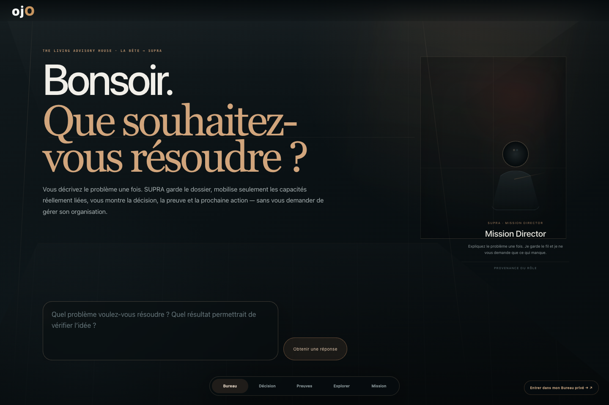
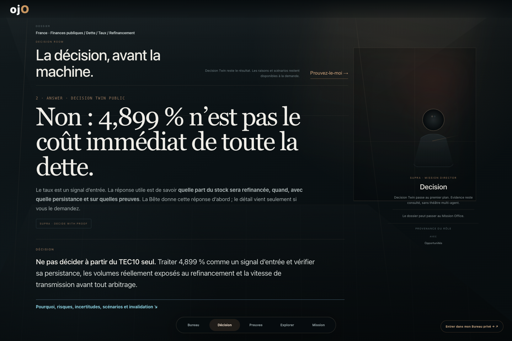
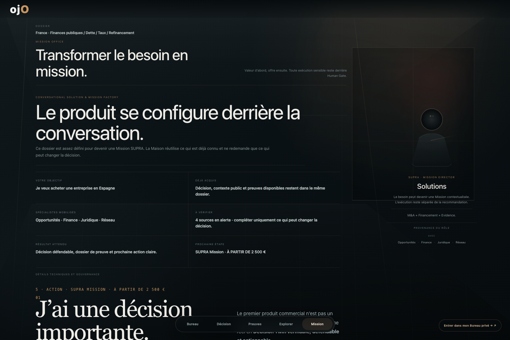
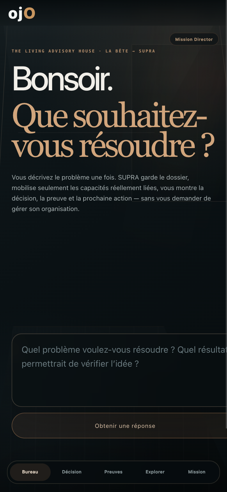
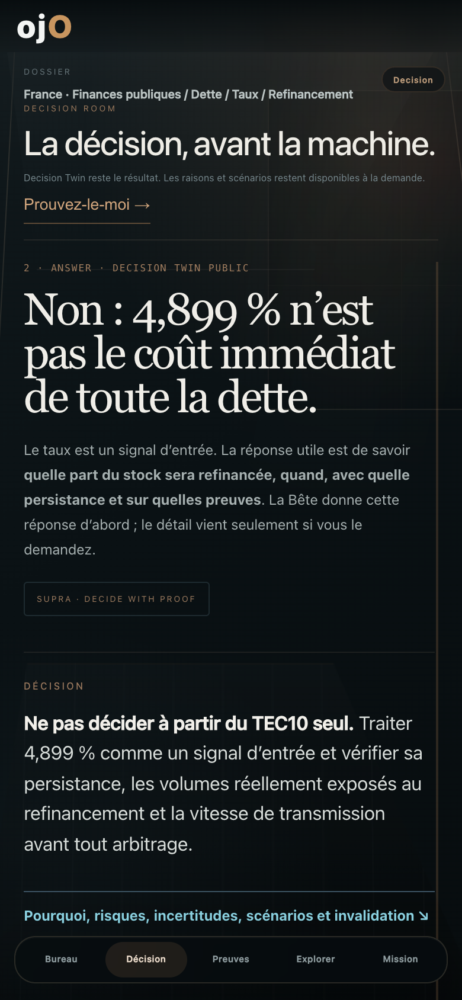

# LA_BETE_LIVING_ADVISORY_HOUSE_PREMIUM_EXPERIENCE_V1.1

## Statut

La V5 publique a été **rejetée en revue humaine réelle** le 05/10/2026.

Constat de la revue : la page publique ressemblait encore à une page web/dashboard premiumisée : conteneur central, rail latéral, cartes, petits textes, chrome UI et faible sensation de lieu.

Conséquence : le Gate 10 de la mission V1 a été déclaré **FAIL**. Aucun merge / aucun déploiement du premier candidat Premium V1 n'a été autorisé.

La présente V1.1 reconstruit uniquement la **couche de présentation**. Aucun moteur, registre, truth store, memory store ou pouvoir d'exécution n'est ajouté.

## Baseline et isolation

- Base canonique : `origin/main@ee2a5fb5ed92e06d23568a9da056c340a99e7f34`
- Branche : `mission/la-bete-living-advisory-house-premium-experience-v1-20261005`
- Worktree isolé : `/Users/nicolasalonso/NOVA_DEV/ORA_NOVA_SCIC_LA_BETE_PREMIUM_EXPERIENCE_V1_20261005`
- `main` non muté.
- Worktree concurrent territoire préservé.

## Rupture V1.1

La V1.1 élimine le modèle « grand rectangle + sidebar + cartes ».

### 1. Maison = viewport

La Maison occupe désormais le viewport complet.

- zéro conteneur central,
- zéro bord arrondi global,
- zéro sidebar persistante,
- zéro navigation métier en haut,
- scène architecturale en arrière-plan,
- une seule salle active.

### 2. Arrival Lounge

Le Bureau devient un véritable lounge d'accueil.

- question principale souveraine,
- champ de conversation directement dans la scène,
- Mission Director présent dans la pièce,
- aucune taxonomie métier imposée,
- aucun bloc fonctionnel préalable.

### 3. Room sovereignty

Quand l'utilisateur entre dans Décision / Preuves / Observatory / Mission :

- le hall disparaît,
- la salle occupe le viewport,
- le dossier reste discrètement présent,
- le Mission Director devient une présence latérale,
- le dock de passages reste le seul chrome permanent.

### 4. Specialist presence

La présence spécialiste utilise exclusivement :

`LaBeteAdvisoryHouseV5.specialist_binding_proof`

Elle ne crée aucun expert humain fictif.

Les rôles visibles sont des projections numériques liées aux cockpits SUPRA existants.

Autorité :

`ROUTING_ONLY_NOT_EXECUTION_PROOF`

### 5. Decision Room

Decision Twin reste souverain.

La décision devient typographiquement dominante.

Le second bloc « profondeur progressive » est retiré de la surface normale.

Les raisons détaillées restent accessibles progressivement.

Le passage vers la preuve est explicitement disponible :

`Prouvez-le-moi →`

### 6. Evidence Room

La surface normale ne commence plus par le graphe technique.

Elle expose d'abord les claims / pièces vérifiables.

ProofGraph / relations techniques restent le même spine, sans nouvelle vérité.

### 7. Mission Office

Le moment commercial expose d'abord :

- votre objectif,
- ce que nous savons déjà,
- spécialistes mobilisés,
- ce qui reste à vérifier,
- résultat attendu,
- prochaine étape.

Le prix arrive après la valeur.

Les détails techniques / gouvernance restent repliés.

### 8. Mobile

Le mobile n'est plus une réduction du desktop.

- une salle plein écran,
- Mission Director compact,
- cinq passages dans un dock bas,
- aucune sidebar,
- aucune miniature architecturale,
- pas de dépassement horizontal de page.

## Invariants préservés

- QUESTION → DECISION → PROOF → EXPLORE → MISSION : PASS
- SECOND_ENGINE = NO
- SECOND_REGISTRY = NO
- SECOND_TRUTH = NO
- PRIVATE_STORAGE_PUBLIC = NO
- EXECUTION_AUTHORITY_PROMOTED = NO
- Decision Twin = SOVEREIGN
- ProofGraph = UNCHANGED_SPINE
- Cosmos = VOLUNTARY
- `supra://private-office` = payload-free
- spécialistes = real existing SUPRA bindings only

## Preuves V1.1

### Premium

- Static gate : `LA_BETE_PREMIUM_EXPERIENCE_V1_STATIC_PASS 11`
- Browser gate : PASS
- Scénario A M&A : PASS
- Scénario B Financing : PASS
- Scénario C Proof : PASS
- Scénario D Explore : PASS
- Scénario E Mission : PASS
- Navigation history : PASS
- Reduced motion : PASS
- Mobile : PASS
- Browser exceptions : 0

### Non-régression

- V5 static : `LA_BETE_ADVISORY_HOUSE_V5_STATIC_PASS 13`
- Explorer static : `LA_BETE_EXPLORER_TESTS_PASS 82`
- Explorer browser : PASS / 0 exception
- Evolution unit : `LA_BETE_EVOLUTION_THREE_REGIMES_AND_SELF_MODEL_PASS`
- Evolution verification : `LA_BETE_VIRTUOUS_EVOLUTION_NON_REGRESSION_PASS`
- `git diff --check` : PASS

## Captures V1.1

### Arrival Lounge — desktop

### Decision Room — desktop

### Mission Office — desktop

### Arrival Lounge — mobile

### Decision Room — mobile

## Gate humain

La V5 publique est rejetée.

La V1.1 reste **candidate** jusqu'à revue humaine de ces nouvelles captures.

Aucun merge / aucun Pages deploy avant validation explicite.

Verdict courant :

`PROVEN_TECHNICAL_V1_1_AWAITING_HUMAN_PREMIUM_REVIEW`
