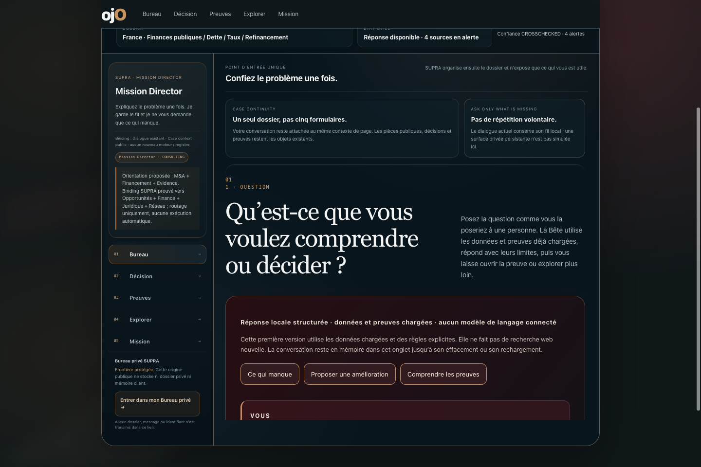
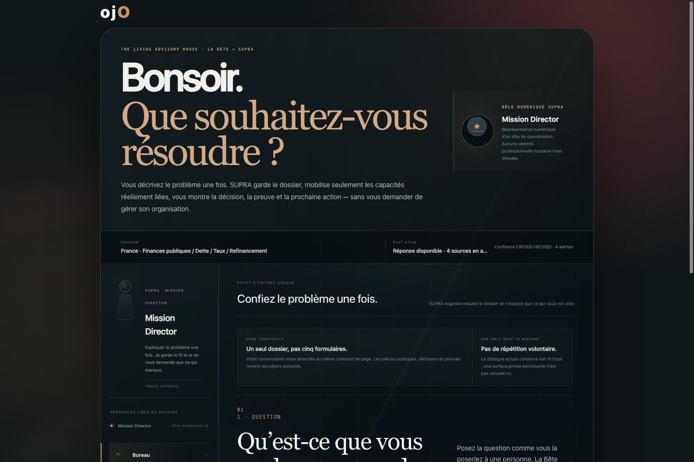
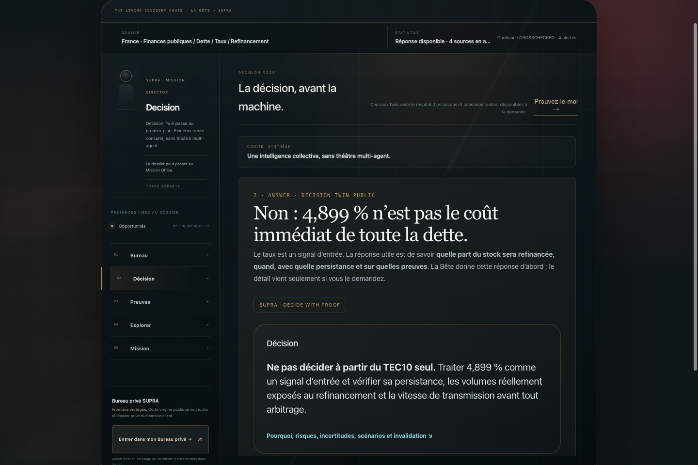
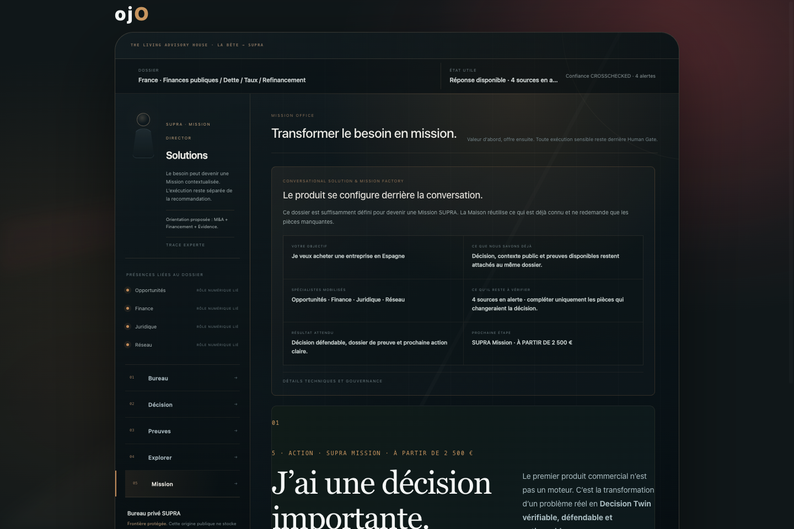
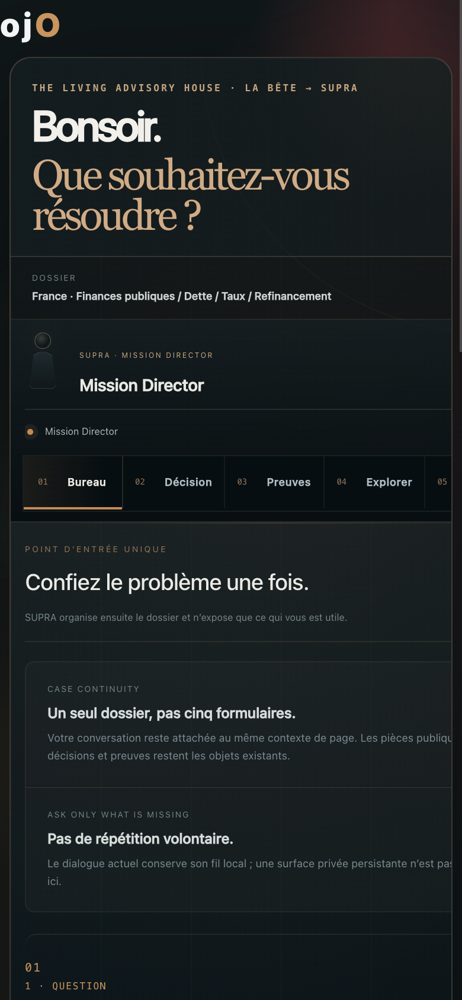
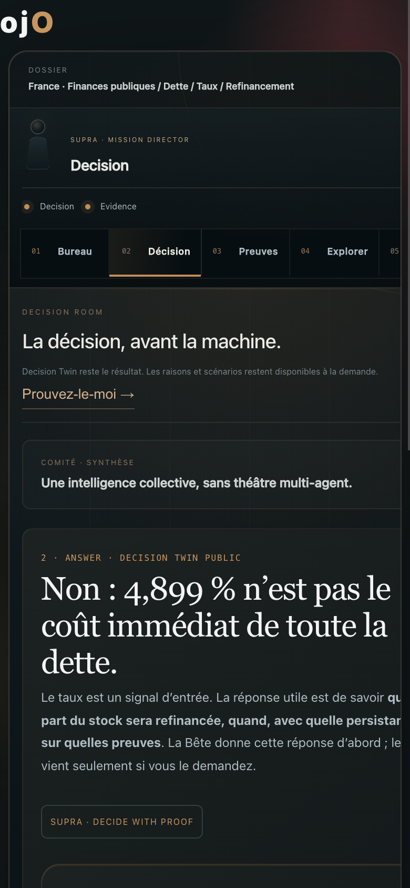

# LA_BETE_LIVING_ADVISORY_HOUSE_PREMIUM_EXPERIENCE_V1

## État

Candidat isolé construit depuis `origin/main@ee2a5fb5ed92e06d23568a9da056c340a99e7f34`.

Branche : `mission/la-bete-living-advisory-house-premium-experience-v1-20261005`

Worktree : `/Users/nicolasalonso/NOVA_DEV/ORA_NOVA_SCIC_LA_BETE_PREMIUM_EXPERIENCE_V1_20261005`

Aucune mutation de `main` ni déploiement public n'est autorisé avant le Gate 10 humain.

## Contrat préservé

- QUESTION → DECISION → PROOF → EXPLORE → MISSION reste le parcours canonique.
- Decision Twin reste le résultat principal.
- ProofGraph + Evidence Universe restent la colonne vertébrale probante.
- Cosmos reste volontaire et n'est jamais activé par la scénographie seule.
- `supra://private-office` reste un deep link sans payload.
- Les spécialistes visibles sont dérivés de `LaBeteAdvisoryHouseV5.specialist_binding_proof`.
- Autorité : `ROUTING_ONLY_NOT_EXECUTION_PROOF`.
- Aucun second moteur, registre, runtime, truth store, memory store ou stockage privé public.

## Spatial grammar réutilisable

La couche Premium est une couche de présentation au-dessus de V5. Elle ne possède pas de données métier.

Principes :

1. **Arrival Lounge** — grand accueil uniquement lorsque le Bureau est actif.
2. **Room sovereignty** — dès qu'une autre salle devient active, le hall se replie et la salle occupe la scène.
3. **One active room** — les cinq surfaces existantes sont déplacées, jamais clonées.
4. **Specialist presence** — présence abstraite et truthful, issue des bindings existants.
5. **Progressive expertise** — jargon, binding et gouvernance derrière des détails repliés.
6. **Cognitive transitions** — voile court entre salles, désactivé par `prefers-reduced-motion`.
7. **Mobile portals** — une salle plein écran à la fois, navigation horizontale de portails, aucune miniature 3D.
8. **Private boundary** — la même porte DOM est déplacée sur mobile, jamais dupliquée.
9. **Commercial moment** — objectif, acquis, spécialistes, inconnues, résultat et prochaine étape avant l'offre.

Tokens principaux de la couche : pierre sombre, cuivre retenu, bleu analytique, verre discret, lignes architecturales faibles, mouvement court.

## Modifications

- `docs/assets/la-bete-living-advisory-house-premium-v1.css`
- `docs/assets/la-bete-living-advisory-house-premium-v1.js`
- liaison des deux assets Premium dans `docs/france-debt-rate-risk-live-2026-10-02.html`
- extension minimale du routeur V5 existant pour les cinq formulations de test imposées
- `scripts/verify_la_bete_premium_experience_v1.cjs`
- `scripts/test_la_bete_premium_experience_v1_browser.cjs`

Aucun moteur ni registre n'a été créé.

## Preuves

- Premium statique : `LA_BETE_PREMIUM_EXPERIENCE_V1_STATIC_PASS 11`.
- Premium navigateur réel : PASS, cinq scénarios A–E, historique, reduced motion, mobile, zéro exception.
- V5 statique : `LA_BETE_ADVISORY_HOUSE_V5_STATIC_PASS 13`.
- V5 navigateur réel : PASS après l'intégration Premium.
- Explorer : `LA_BETE_EXPLORER_TESTS_PASS 82`.
- Explorer navigateur réel : PASS, zéro exception.
- Evolution : `LA_BETE_EVOLUTION_THREE_REGIMES_AND_SELF_MODEL_PASS`.
- Evolution non-régression : `LA_BETE_VIRTUOUS_EVOLUTION_NON_REGRESSION_PASS`.
- `git diff --check` : PASS.

## Captures de référence

### Avant — V5

### Après — Arrival Lounge

### Après — Decision Room

### Après — Mission Office

### Mobile — Arrival Lounge

### Mobile — Decision Room

## Gate 10 — obligatoire avant promotion

Validation humaine encore requise :

1. Est-ce que cela ressemble encore à une page web ? → cible : **NON**.
2. Est-ce que cela ressemble à un logiciel B2B générique ? → cible : **NON**.
3. Est-ce qu'un dirigeant pourrait avoir envie de confier un dossier sensible ici ? → cible : **OUI**.

Tant que cette validation n'est pas explicitement donnée, le candidat reste bloqué avant merge/deploy.

## Verdict candidat

`PROVEN_TECHNICAL_CANDIDATE_AWAITING_HUMAN_PREMIUM_GATE`

Le verdict `PROVEN_PREMIUM_EXPERIENCE` ne peut être émis qu'après Gate 10 humain puis revalidation de `origin/main`, merge et preuve publique.
